# IMAGE RECOGNITION OF THE SIMPSONS CHARACTERS BASED ON CONVOLUTIONAL NEURAL NETWORK

## Abstract
Machine learning algorithms are developing rapidly in the field of computer vision, and are widely used in the field of pattern recognition and solving complex problems in engineering applications. This paper explores the research and application of image recognition by using deep learning technology to identify Simpson characters as an application scenario. Through the practical application of this research, the understanding and application of deep learning techniques, as well as applications in the field of computer vision, can be improved. In traditional image recognition methods, image recognition mainly uses feature extraction and classification, and feature extraction is mainly based on SIFT, SURF, and other features. Today's deep learning techniques are mainly based on methods such as convolutional neural networks (CNN) and recurrent neural networks (RNN). The CNN method has gradually become the main deep-learning method in the image field.

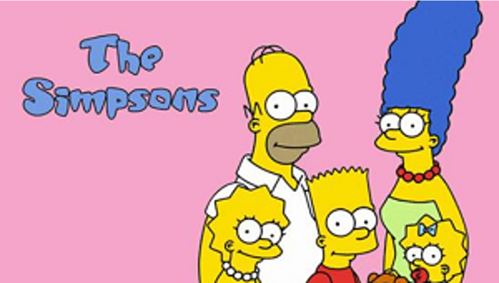

## Dataset
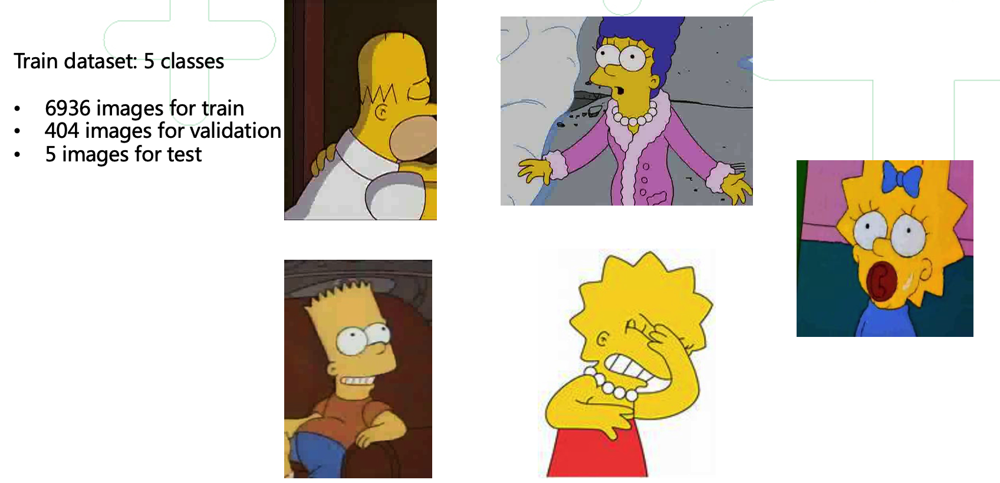

## Transfer Learning
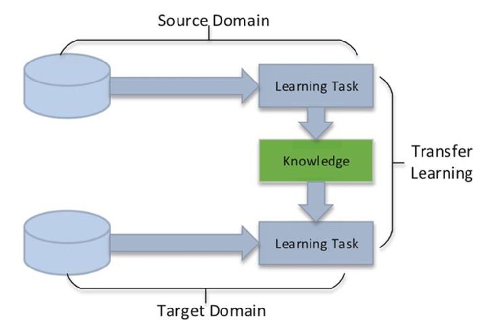

## VGG16
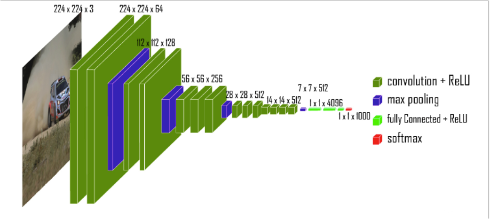

## ResNet50
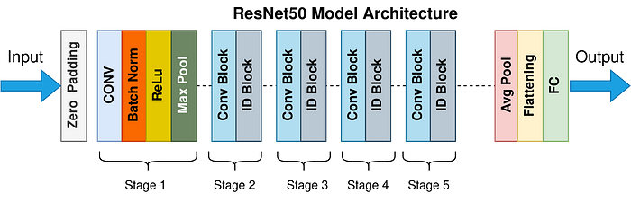

## EfficientNet_B2
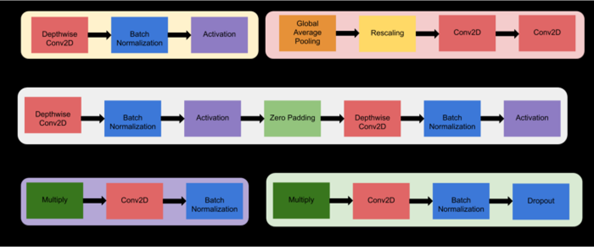

## Model Comparison Results
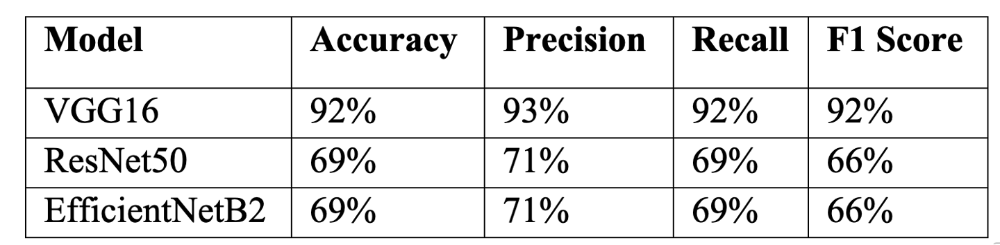
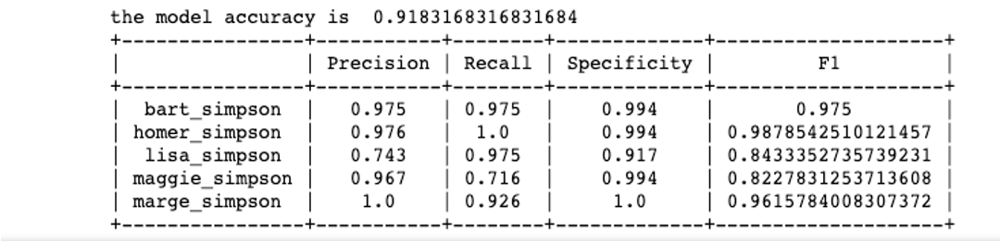

## Curve Figure - VGG16
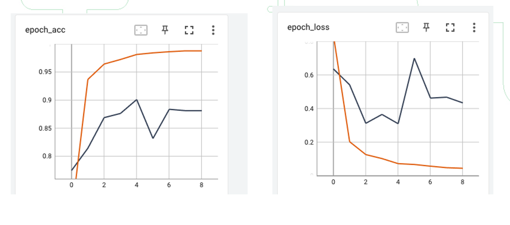

## Confusion Matrix - VGG16
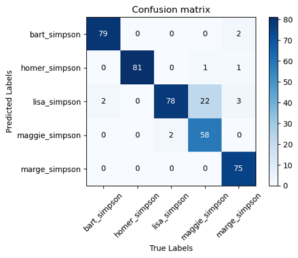

## Predict Results – VGG16
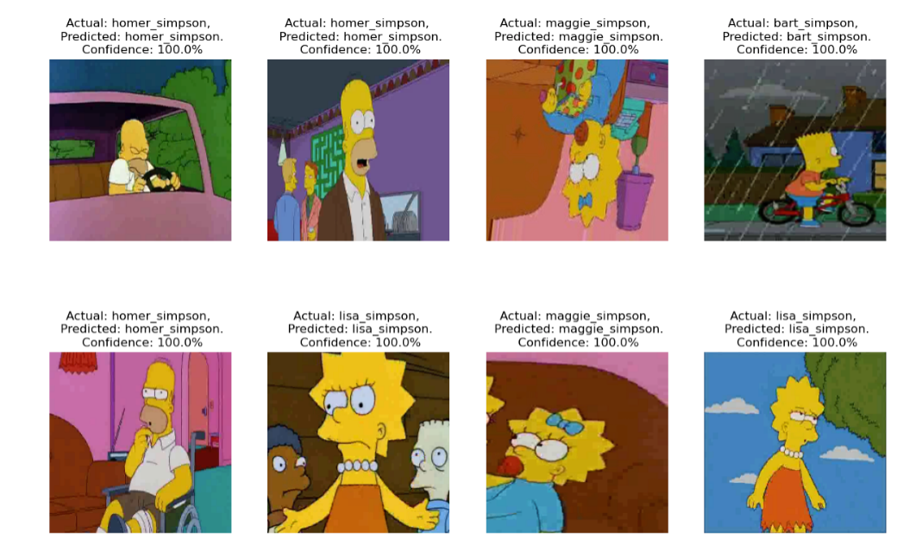

